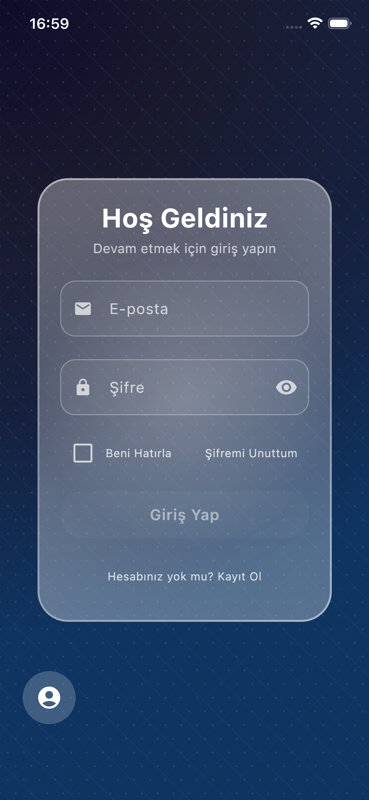
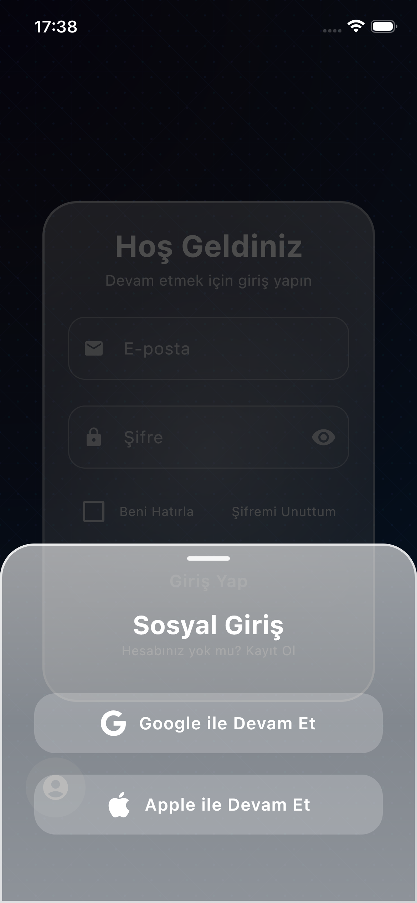

# KMP Auth - Kotlin Multiplatform Authentication App

Modern ve şık bir kimlik doğrulama uygulaması. Android ve iOS platformlarında çalışan Kotlin Multiplatform tabanlı authentication uygulaması.

## 📱 Video Demo

<div align="center">
  <video src="docs/demo.mp4" width="600" autoplay loop muted playsinline controls style="max-width: 100%; border-radius: 12px;">
    Tarayıcınız video etiketini desteklemiyor. Video'yu indirmek için <a href="docs/demo.mp4">buraya tıklayın</a>.
  </video>
</div>

> **Not:** Video otomatik olarak oynatılacak (sessiz modda). Kontroller ile sesi açabilir veya video'yu duraklatabilirsiniz.
> 
> **Alternatif:** Eğer otomatik oynatma çalışmazsa, video'yu YouTube veya Vimeo'ya yükleyip embed edebilirsiniz. Bu daha güvenilir bir yöntemdir.

## ✨ Özellikler

- 🔐 **Email/Password Authentication** - Firebase ile email ve şifre ile giriş
- 🍎 **Apple Sign In** - iOS için Apple ile giriş desteği
- 🔵 **Google Sign In** - Google hesabı ile giriş
- 🔒 **Biometric Authentication** - Face ID / Touch ID desteği
- 💾 **Secure Storage** - Güvenli yerel veri saklama
- 🎨 **Modern UI** - Glassmorphic tasarım ve animasyonlar
- 📱 **Cross-Platform** - Android ve iOS desteği

## 🖼️ Ekran Görüntüleri

### iOS Screenshots

<div align="center">
  
  
  
</div>

## 🛠️ Teknolojiler

- **Kotlin Multiplatform** - Cross-platform geliştirme
- **Compose Multiplatform** - Modern UI framework
- **Firebase Authentication** - Backend authentication servisi
- **Material Design 3** - Modern design system
- **Jetpack Compose** - Declarative UI

## 📋 Gereksinimler

### Android
- Android Studio Hedgehog | 2023.1.1 veya üzeri
- JDK 11 veya üzeri
- Android SDK 24+ (Android 7.0+)

### iOS
- Xcode 15.0 veya üzeri
- macOS 13.0 veya üzeri
- CocoaPods (iOS dependencies için)

## 🚀 Kurulum

### Android

1. Repository'yi klonlayın:
   ```bash
   git clone <repository-url>
   cd Kmp_Auth
   ```

2. Android Studio'da projeyi açın

3. Gradle sync yapın

4. Firebase'i yapılandırın:
   - `composeApp/google-services.json` dosyasını Firebase Console'dan indirip ekleyin

5. Uygulamayı çalıştırın:
   ```bash
   ./gradlew :composeApp:assembleDebug
   ```

### iOS

1. Repository'yi klonlayın:
   ```bash
   git clone <repository-url>
   cd Kmp_Auth
   ```

2. Xcode'da projeyi açın:
   ```bash
   open iosApp/iosApp.xcworkspace
   ```

3. CocoaPods dependencies yükleyin (gerekirse):
   ```bash
   cd iosApp
   pod install
   ```

4. Firebase'i yapılandırın:
   - `GoogleService-Info.plist` dosyasını Firebase Console'dan indirip `iosApp/iosApp/` klasörüne ekleyin

5. Xcode'dan uygulamayı çalıştırın

## 📁 Proje Yapısı

```
Kmp_Auth/
├── composeApp/              # Compose Multiplatform modülü
│   ├── src/
│   │   ├── commonMain/      # Ortak kod (Android & iOS)
│   │   ├── androidMain/     # Android-specific kod
│   │   └── iosMain/         # iOS-specific kod
│   └── build.gradle.kts
├── iosApp/                  # iOS native app
├── docs/                    # Dokümantasyon ve görseller
│   └── screenshots/         # Ekran görüntüleri
└── README.md
```

## 🔧 Yapılandırma

### Firebase Setup

1. [Firebase Console](https://console.firebase.google.com/)'a gidin
2. Yeni bir proje oluşturun
3. Authentication'ı etkinleştirin:
   - Email/Password provider
   - Google Sign-In provider
   - Apple Sign-In provider (iOS için)

### Android Firebase Setup

1. Firebase Console'da Android app ekleyin
2. `google-services.json` dosyasını `composeApp/` klasörüne ekleyin

### iOS Firebase Setup

1. Firebase Console'da iOS app ekleyin
2. `GoogleService-Info.plist` dosyasını `iosApp/iosApp/` klasörüne ekleyin

